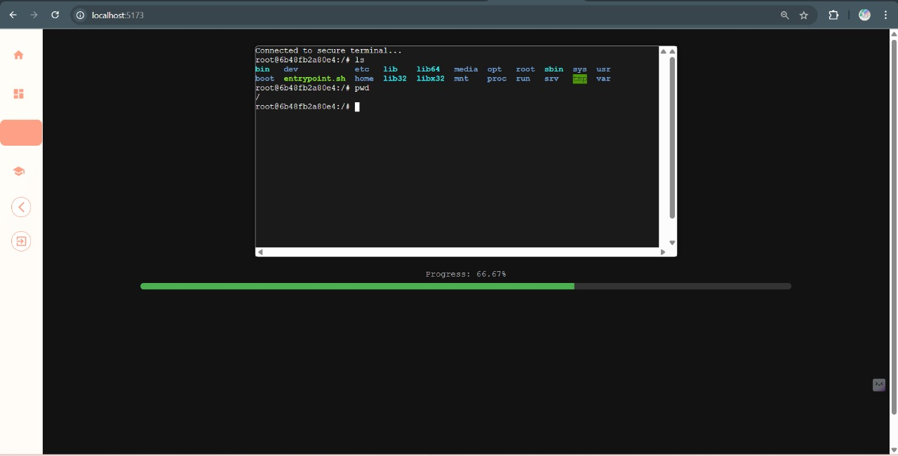

# OS LAB - Secure Terminal Web App

This is a web-based secure terminal interface for OS Lab experiments. The project consists of a React frontend and a Node.js backend, with the backend containerized using Docker.

## Prerequisites

- Node.js (v16 or later)
- Docker
- npm

## Frontend Setup

1. Navigate to the frontend directory:

   ```bash
   cd frontend
   ```

2. Install dependencies:

   ```bash
   npm install
   ```

3. Start the development server:
   ```bash
   npm run dev
   ```

Frontend will be available at `http://localhost:5173/` (or as configured).

## Backend Setup

1. Navigate to the backend directory:

   ```bash
   cd backend
   ```

2. Build the Docker image:

   ```bash
   docker build -t secure-terminal-image .
   ```

   **Note:** If you rename the image tag (`secure-terminal-image`), update the reference in `server.js`.

3. Install dependencies:

   ```bash
   npm install
   ```

4. Start the backend server:
   ```bash
   npm run dev
   ```

Backend will be running at `http://localhost:3001/` by default.

## Screenshots



## Notes

- Ensure Docker is running before launching the backend.
- The backend executes terminal commands inside Docker for isolation and security.
- Modify `server.js` to customize terminal behavior.
